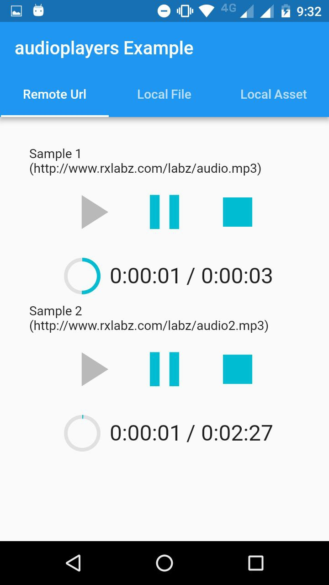
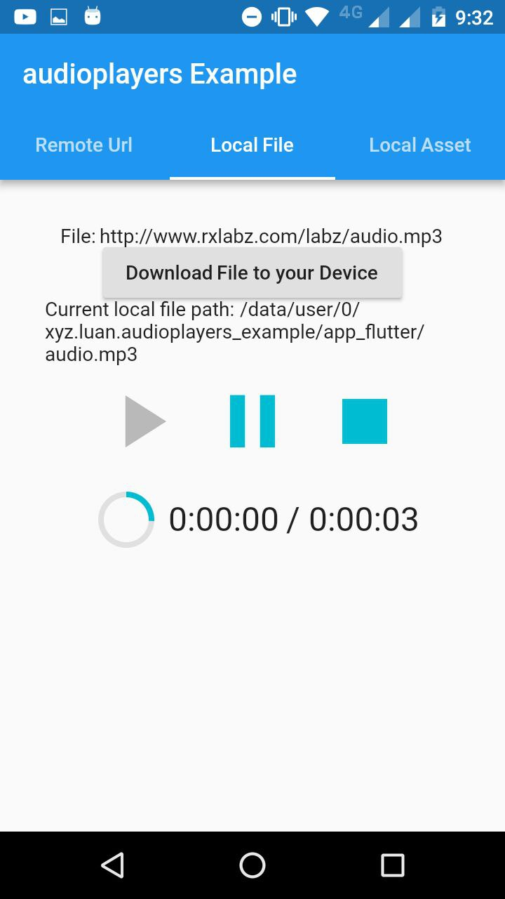
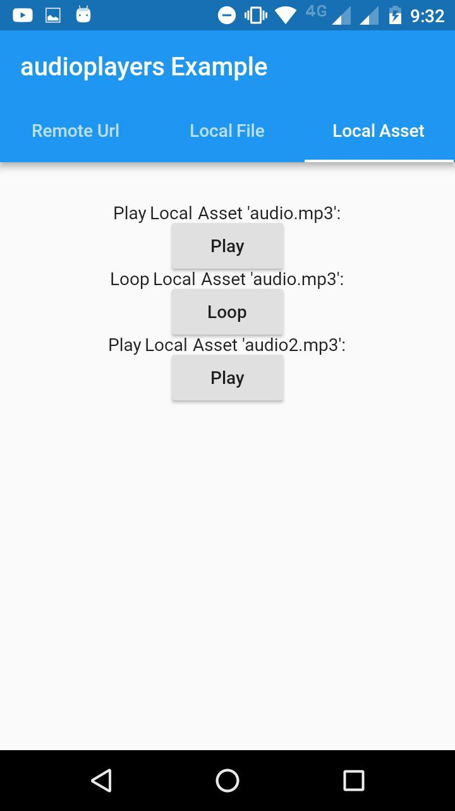

# AudioPlayers

A Flutter plugin to play multiple simultaneously audio files, works for Android and iOS.

<center>
    
</center>

## Usage

An `AudioPlayer` instance can play a single audio at a time. To create it, simply call the constructor:

```dart
    AudioPlayer audioPlayer = new AudioPlayer();
```

You can create multiple instances to play audio simultaneously.

For all methods that return a `Future<int>`: that's the status of the operation. If `1`, the operation was successful. Otherwise it's the platform native error code.

Logs are disable by default! To debug, run:

```dart
  AudioPlayer.logEnabled = true;
```

### Playing Audio

In order to play audio, use either the `play` or `loop` commands (loop just keeps replaying after finished).

There are three possible sources of audio:

 - Remote file on the Internet
 - Local file on the user's device
 - Local asset from your Flutter project

Both for Remote Files or Local Files, use either the `play` or the `loop` commands (loop just keeps replaying after finished), just setting appropriately the flag `isLocal`.

For Local Assets, you have to use the `AudioCache` class (see below).

To play a Remote File, just call `play` with the url (the `isLocal` parameter is false by default):

```dart
  play() async {
    int result = await audioPlayer.play(url);
    if (result == 1) {
      // success
    }
  }
```

For a Local File, add the `isLocal` parameter:

```dart
  playLocal() async {
    int result = await audioPlayer.play(localPath, isLocal: true);
  }
```

To play on a loop, call the loop method, instead of play (same signature):


```dart
  loopLocal() async {
    int result = await audioPlayer.loop(localPath, isLocal: true);
  }
```

Loop will actually set a Completion Handler to replay your audio (so don't forget to clear it if you use the same player for something else!).

The `isLocal` flag is required only because iOS makes a difference about it (Android doesn't care either way).

There is also an optional named `double volume` parameter, that defaults to `1.0`. It can be bumped as desired.

### Controlling

After playing, you can control the audio with pause, stop and seek commands.

Pause will pause the audio but keep the cursor where it was. Subsequently calling play will resume from this point.

```dart
  int result = await audioPlayer.pause();
```

Stop will stop the audio and reset the cursor. Subsequently calling play will resume from the beginning.

```dart
  int result = await audioPlayer.stop();
```

Finally, use seek to jump through your audio:

```dart
  int result = await audioPlayer.seek(new Duration(milliseconds: 1200));
```

### Handlers

You can register callbacks for several event handlers, like so:

### Duration Handler

This handler returns the duration of the file, when it's available (it might take a while because it's being downloaded or buffered).

```dart
  player.durationHandler = (Duration d) {
    print('Max duration: $d');
    setState(() => duration = d);
  };
```

### Position Handler

This handler updates the current position of the audio. You can use it to make a progress bar, for instance.

```dart
  player.positionHandler = (Duration  p) => {
    print('Current position: $d');
    setState(() => duration = d);
  };
```

### Completion Handler

This handler is called when the audio finishes playing; it's used in the loop method, for instance.

It does not fire when you interrupt the audio with pause or stop.

```dart
  player.completionHandler = () {
    onComplete();
    setState(() {
      position = duration;
    });
  };
```

### Error Handler

This is called when an unexpected error is thrown in the native code.

```dart
  player.errorHandler = (msg) {
    print('audioPlayer error : $msg');
    setState(() {
      playerState = PlayerState.stopped;
      duration = new Duration(seconds: 0);
      position = new Duration(seconds: 0);
    });
  };
```

### AudioCache

In order to play Local Assets, you must use the `AudioCache` class.

Flutter does not provide an easy way to play audio on your assets, but this class helps a lot. It actually copies the asset to a temporary folder in the device, where it is then played as a Local File.

It works as a cache because it keep track of the copied files so that you can replay then without delay.

You can find the full documentation for this class [here](doc/audio_cache.md).

## Supported Formats

You can check a list of supported formats below:

 - [Android](https://developer.android.com/guide/topics/media/media-formats.html)
 - [iOS](http://www.techotopia.com/index.php/Playing_Audio_on_iOS_8_using_AVAudioPlayer#Supported_Audio_Formats)

## iOS
   
### :warning: Swift project

- this plugin is written in swift, so to use with in a Flutter/ObjC project, 
you need to convert the project to "Current swift syntax" ( Edit/Convert/current swift syntax)  

## :warning: iOS App Transport Security

By default iOS forbids loading from non-https url. To cancel this restriction edit your .plist and add :
 
```xml
<key>NSAppTransportSecurity</key>
<dict>
    <key>NSAllowsArbitraryLoads</key>
    <true/>
</dict>
```

## Credits

This was originally a fork of [rxlabz's audioplayer](https://github.com/rxlabz/audioplayer), but since we have diverged and added more features.  

Thanks for @rxlabz for the amazing work!  
